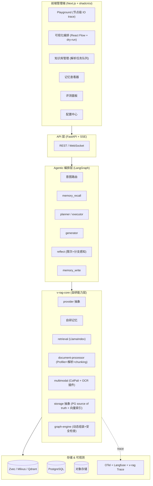
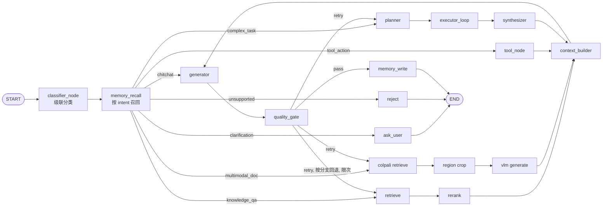

# v-rag 技术选型与系统设计规格（Tech Selection & System Design Spec）

- **项目**：v-rag —— 新型 Agentic RAG 系统（开源）
- **状态**：Draft（待 spec review + 用户终审）
- **日期**：2026-07-03
- **范围**：整体技术选型 + 架构 + 核心模块设计 + MVP 路线图。各模块的接口级细节、数据 schema DDL、完整测试用例由后续各 Phase 的子 spec 承载。

---

## 1. 背景与定位

### 1.1 一句话定位

> **v-rag = 以 LangGraph 状态图为大脑、以意图路由为入口、以自研长期记忆为持久层、多模态原生、可在 Web 端可视化配置与调试的开源 Agentic RAG 系统。**

### 1.2 与现有开源 RAG 平台的差异

| 平台 | 定位 | v-rag 的差异点 |
|---|---|---|
| Dify / FastGPT / RAGFlow | 通用 LLM 应用/工作流平台 | v-rag 专注 **Agentic RAG**，意图路由 + 自主规划是一等公民 |
| LangGraph / LlamaIndex | 通用 AI 框架（库） | v-rag 是**开箱即用的系统**（含 Web 管理端），不是套壳框架 |
| Mem0 / Letta / Zep | 记忆中间件 | v-rag **自研记忆**，避免重依赖，掌握核心能力 |

### 1.3 设计哲学

1. **核心能力自研，外部组件可替换**：记忆、路由、编排逻辑掌握在自己手里；provider/向量库/OCR/解析器均为可替换的抽象层。避免成为 LangGraph/Mem0/LlamaIndex 的"套壳"。
2. **PostgreSQL 为 source of truth**：所有需要状态管理、版本、审计、权限的数据，PG 是唯一真相源；向量库仅作索引层。
3. **配置驱动而非代码驱动**：意图分类、路由分支、节点参数、图结构，全部由管理端配置，无需改代码。
4. **安全优于灵活**：可视化编排采用 Node Registry 白名单，图 JSON 不携带任何可执行代码。
5. **YAGNI**：图谱推理、多租户等暂不实现，但保留 graph-ready / 多租户可扩展的结构。

---

## 2. 2026 趋势调研结论（选型依据）

### 2.1 RAG 范式演进

RAG 已从"检索-生成"管线演进为 **Agentic RAG**：图编排为骨架、意图路由为入口、记忆与规划为大脑。v-rag 踩在此主线上。

- **图编排成主流**：LangGraph 用显式 DAG 节点表达路由/检索/反思，替代单体管线。
- **意图路由成标准决策点**：从静态检索 → LLM-as-judge 动态路由。
- **MCP（模型上下文协议）崛起**：工具/检索器接入的开放标准。

### 2.2 主流框架对比（决定后端骨架）

| 框架 | 擅长 | 在 v-rag 中的角色 |
|---|---|---|
| **LangGraph** | 动态多 Agent、状态图编排 | **编排层**（意图路由 + 规划 + 反思的图引擎） |
| **LlamaIndex** | 数据接入、检索、hybrid/rerank | **检索层**（封装在 retrieval 单元后，可替换） |
| Haystack | 生产级管线 | 不采用（Agentic 能力弱） |

### 2.3 关键能力的技术对应

| 能力 | 2026 主流方案 | v-rag 选择 |
|---|---|---|
| 意图路由 | LangGraph 节点 + 混合路由（规则+语义+LLM） | 级联路由（见 §6.2） |
| 自主规划 | ReAct + Plan-and-Execute + Reflexion | 全部支持，按 intent 分支选用 |
| 多模态 | ColPali/ColQwen2（页面级视觉检索，免 OCR） | 采用，二阶段检索（见 §8） |
| 长期记忆 | Mem0 / Zep(Graphiti) / Letta(MemGPT) | **自研**（借鉴 MemGPT+Mem0 思想），graph-ready |
| 向量库 | Qdrant / Weaviate / pgvector / Milvus / Zvec | Zvec（默认本地）+ Milvus（规模），Qdrant 可选 |
| 可观测 | Langfuse / LangSmith / OTel | OpenTelemetry + Langfuse + v-rag Trace Schema 三层 |

### 2.4 关键参考来源

- Agentic RAG 综述：arXiv 2501.09136
- Agentic 检索/路由：Redis blog "Agentic Retrieval Techniques"
- Agent 架构 2026 Taxonomy：digitalapplied.com
- 记忆基准：mem0.ai/blog/state-of-ai-agent-memory-2026；particula.tech 基准
- 多模态 RAG：bigdataboutique.com "Multimodal RAG in 2026"
- 向量库对比：lushbinary.com Qdrant/Weaviate/Milvus
- Zvec：zvec.org、github.com/alibaba/zvec（阿里通义，Apache 2.0，嵌入式）

---

## 3. 已确认的技术选型（决策记录）

| 维度 | 决策 | 理由 |
|---|---|---|
| 后端语言 | **Python** | AI/RAG 生态绝对主流；CLAUDE.md 已配 Python/FastAPI 技能栈 |
| Web 框架 | **FastAPI** | 异步 + SSE 流式 + Pydantic v2，2026 LLM 后端事实标准 |
| AI 编排 | **LangGraph** | 状态图天生表达意图路由与规划 |
| 检索引擎 | **LlamaIndex**（封装） | 数据接入/rerank/hybrid 成熟，避免重造轮子；封装后可替换 |
| 长期记忆 | **自研 v-rag-core/memory** | 核心能力自研，不依赖 Mem0/Letta |
| 模型接入 | **混合**：商业 API（OpenAI/Claude/Gemini）+ 开源自部署（Ollama/vLLM） | 统一 provider 抽象，按配置切换 |
| 多模态检索 | **ColPali/ColQwen2** | 页面级视觉检索，免 OCR，保版式 |
| 文档解析 | **Docling + Unstructured + PyMuPDF** | 覆盖纯文本/复杂版式/异构格式，按质量路由 |
| OCR | **插件化**：PaddleOCR-VL（默认）+ 可选插件 | 协议化，可扩展 |
| 向量库 | **Zvec（默认本地）+ Milvus（规模），Qdrant 可选** | 嵌入式零运维 + 规模化升级路径 |
| 关系库 | **PostgreSQL** | 所有长期记忆与配置的 source of truth |
| 可观测 | **OpenTelemetry + Langfuse + v-rag Trace Schema** | 标准 trace + LLM 观测 + 业务 trace，不绑单一平台 |
| 前端 | **Next.js 16 + shadcn/ui + Tailwind v4 + React Flow** | 2026 管理后台标准 + 可视化编排 |
| MVP 策略 | **差异化主线优先** | 先立意图路由+规划差异点 |

---

## 4. 系统架构

### 4.1 分层架构



### 4.2 一次查询的数据流

```
用户输入
  → classifier_node  (级联: 规则→语义→LLM, 含 clarification/unsupported 兜底)
  → memory_recall    (按 intent 决定召回哪些 scope，经 Memory Gate)
  → 按 intent 分支:
      chitchat            → generator
      knowledge_qa        → retrieve → rerank → (低置信则 fallback ColPali) → generator
      multimodal_doc      → ColPali page retrieve → region crop → VLM generator
      tool_action         → tool_node → generator
      complex_task        → planner → executor_loop → synthesizer
      clarification_needed→ 追问用户
      unsupported         → 拒绝/说明
  → context_builder   (合并 memory + retrieval + tool 结果, 压缩)
  → generator
  → quality_gate / reflect (限次, 按分支回退)
  → memory_write      (经 Policy Gate)
  → END
全程: OTel+Langfuse+v-rag Trace 记录, 绑定 graph_config_id+version
```

---

## 5. v-rag-core 模块分解

后端核心包，10 个单元，每个单一职责、可独立测试：

| 单元 | 职责 |
|---|---|
| `provider-abstraction` | 统一 LLM/embedding/VLM/rerank 接口，商业+本地可切 |
| `intent-router` | 意图分类 + 可配置级联路由策略 |
| `planner` | Plan-and-Execute / ReAct / Reflexion 规划器 |
| `memory` | 自研长期记忆（情景/语义/程序，含 Gate 与 Context Builder） |
| `retrieval` | 检索引擎封装（LlamaIndex：hybrid/rerank/query transform） |
| `document-processor` | DocumentProfiler + 解析器路由 + Canonical Block + 多粒度 chunking |
| `multimodal` | ColPali 二阶段视觉检索 + OCR 插件管理 |
| `storage` | PG source of truth + 向量索引抽象（Zvec/Milvus/Qdrant 可切） |
| `graph-engine` | LangGraph 动态组装 + Node Registry + 图安全检查 + 版本缓存 |
| `observability` | OTel + Langfuse + v-rag Trace Schema 埋点 |

---

## 6. 核心模块设计（一）：自研记忆 + 意图路由

### 6.1 自研长期记忆（`memory`）

借鉴 MemGPT（分层）+ Mem0（事实抽取/合并）思想，完全自研实现。

#### 6.1.1 三类记忆

| 类型 | 存什么 | 结构关键字段 |
|---|---|---|
| 情景 Episodic | 时序对话事件 | user/session_id, content, embedding, ts, importance |
| 语义 Semantic | 抽取的事实/偏好 | subject, predicate, object, confidence, valid_from/to |
| 程序 Procedural | 技能/工作流 | skill_name, trigger, action_spec, version |

#### 6.1.2 记忆元数据（scope / status / TTL / sensitivity）

每条记忆携带：
```python
scope: Literal["user", "session", "project", "workspace", "agent", "org"]
status: Literal["active", "candidate", "superseded", "deleted", "expired"]
valid_from: datetime | None
valid_to: datetime | None
ttl: int | None
sensitivity: Literal["normal", "private", "sensitive"]
source_event_id: str
```

#### 6.1.3 存储分工（PG 为 source of truth）

**PostgreSQL 持有全部长期记忆的真相**，向量库仅为索引层：

- PG 表：`memory_event` / `memory_fact` / `memory_procedure` / `memory_feedback` / `memory_consolidation_log` / `memory_trace`
- 向量索引：`{embedding, memory_id, memory_type, scope, metadata_filter_fields}`
- 理由：向量库不适合承载状态管理、版本、删除审计、权限、Trace 追溯。

向量库默认 Zvec（本地 QuickStart），生产可选 Qdrant，企业规模 Milvus。

#### 6.1.4 写入路径（含 Policy Gate）

```
Conversation/Tool/Document Event
  → Candidate Extractor
  → Importance Scorer
  → Memory Type Classifier
  → Policy Gate:
      - 是否有长期价值
      - 是否敏感 / 是否需用户确认
      - 是否与已有记忆冲突
      - 是否只应保留在当前会话
  → Dedup / Merge / Conflict Resolve
  → Write PostgreSQL
  → Write Vector Index
  → Trace Log
```

**关键约束**：不把模型生成内容无条件写为事实。优先写：用户明确陈述、工具返回的结构化结果、文档可溯源事实。

#### 6.1.5 读取路径（含 Memory Gate + Context Builder）

```
recall(query)
  → query rewrite
  → vector recall + BM25 recall + recent episodic recall
  → rerank / scoring
  → Memory Gate:
      relevance / recency / confidence / importance / scope match / conflict check / sensitivity check
  → Context Builder
  → compressed memory context (不全塞 prompt)
```

**关键约束**：召回结果不直接进 prompt，必须经 Gate 过滤 + Context Builder 压缩。

#### 6.1.6 巩固与遗忘

- `consolidate(user_id)`：后台合并近似事实、重算置信度、衰减过期条目（仿"睡眠巩固"）。
- `forget(filter)`：显式遗忘 + 低置信淘汰。

#### 6.1.7 API（public 最小化，内部预留管理接口）

```python
# public
remember(event: MemoryEvent) -> MemoryId
recall(query: str, top_k: int) -> list[Memory]
consolidate(user_id: UserId) -> ConsolidateReport
forget(filter: MemoryFilter) -> int

# 内部预留（管理端/调试用，首版可不暴露 public）
list_memories(filter: MemoryFilter) -> list[Memory]
update_memory(memory_id: MemoryId, patch: MemoryPatch) -> Memory
feedback(memory_id: MemoryId, feedback: MemoryFeedback) -> None
```

#### 6.1.8 graph-ready（暂不做图谱，保留结构）

- v0.1：不实现 Cognee/Graphiti 图谱推理。
- v0.1：Semantic Memory 保留三元组 + 时效字段 + `graph_adapter` 接口。
- v0.2/v0.3：接入 Cognee / Graphiti / Neo4j，无需推翻数据结构。

### 6.2 意图路由与 LangGraph 图（`intent-router` + `graph-engine`）

#### 6.2.1 Intent Taxonomy（MVP 7 类）

| 意图 | 分支 | 说明 |
|---|---|---|
| `chitchat` | generator | 闲聊 |
| `knowledge_qa` | retrieve→rerank→generate | 知识检索（文本优先） |
| `multimodal_doc` | ColPali→VLM | 多模态文档 |
| `tool_action` | tool→generate | 工具调用 |
| `complex_task` | planner→executor→synthesizer | 复杂规划 |
| `clarification_needed` | 追问用户 | 信息不足（未指定知识库/文件/对象/时间） |
| `unsupported_or_rejected` | 拒绝/说明 | 不支持或不允许 |

新增 `clarification_needed` / `unsupported_or_rejected` 避免误检索/误调用/误规划。

#### 6.2.2 级联路由 + 置信度分层

```
query → 规则路由 (关键词/角色/知识库, 确定性)
      → 语义路由 (query emb vs 意图原型 emb)
      → LLM 路由 (兜底)
置信度: >=0.85 直接路由; 0.60~0.85 LLM 复核; <0.60 → clarification 或 LLM
（以上阈值为初始默认值，P1 阶段用真实路由数据校准）
```

记录 `route_trace`（rule_result / semantic_result / llm_result / final_intent / confidence / reason），供 Trace UI 解释路由决策。

#### 6.2.3 LangGraph 状态图



要点：
- **memory_recall 节点**在分类后、分支前，按 intent 决定召回 scope（chitchat 轻量；knowledge_qa 召回 project/user；complex_task 召回 episodic/semantic/procedural）。
- **reflect/quality_gate**：`max_reflect_rounds`（默认 2），**按分支回退**（knowledge_qa 回 retrieve/rerank；multimodal 回 colpali；complex_task 回 planner），非统一回 retrieve。

#### 6.2.4 VragState（含工程字段）

```python
class VragState(TypedDict):
    # 上下文标识
    query: str
    user_id: str | None
    session_id: str | None
    workspace_id: str | None
    knowledge_base_id: str | None
    # 图配置与版本（可视化编排/灰度/回放）
    graph_config_id: str | None
    graph_version: str | None
    # 路由
    intent: Intent | None
    confidence: float
    route_trace: dict
    # 中间产物
    memory_hits: list[Memory]
    retrieved_docs: list[Doc]
    multimodal_hits: list[Doc]
    tool_results: list[ToolResult]
    plan: list[Step] | None
    current_step: int | None
    # 输出
    context_blocks: list[ContextBlock]
    generation: str
    reflection: Reflection | None
    # 工程治理
    errors: list[ErrorInfo]
    budget: RunBudget
    trace_id: str
    messages: Annotated[list, add_messages]
```

### 6.3 可视化编排（核心差异点）

#### 6.3.1 Node Registry 白名单

前端只能选后端注册过的节点类型；图 JSON 只描述结构，**不携带任何代码**：

```python
NodeDefinition:
    type: str                 # classifier_node / retrieve_node / ...
    input_schema: dict
    output_schema: dict
    config_schema: dict
    executable: Callable      # 仅后端持有
```

图 JSON：`{nodes: [...], params: {...}, edges: [...], conditions: [...], version}`。

注册节点：classifier / memory_recall / retrieve / rerank / colpali_retrieve / tool / planner / executor / context_builder / generator / reflect / memory_write。

#### 6.3.2 图配置版本管理

PG 表：`agent_graph_config` / `agent_graph_version` / `agent_graph_publish_history` / `agent_graph_run_trace`。

生命周期：`draft → published → archived`。支持：保存草稿 / 测试运行 / 发布版本 / 回滚版本 / 复制为新 Agent。

#### 6.3.3 动态组装 + 安全检查 + 缓存

```
读 graph_config
  → schema validation
  → node registry 校验 (白名单)
  → edge condition 校验
  → graph safety check:
      - 有 START / END
      - 无不可达节点
      - 无无限循环 (受 max_reflect_rounds 等约束)
      - 不超最大节点数
  → compile LangGraph
  → cache compiled graph by (graph_config_id, version)
  → execute → write trace
```

---

## 7. 核心模块设计（二）：文档处理 + 多模态 + OCR

### 7.1 文档处理（`document-processor`）

#### 7.1.1 DocumentProfiler（解析前画像）

路由不只看扩展名，而看实际质量。画像字段：

```
file_type, page_count, is_scanned_pdf, text_extractable_ratio,
image_area_ratio, table_density, formula_density, language,
layout_complexity, quality_score
```

#### 7.1.2 解析器路由

| 文档特征 | 路由到 | 理由 |
|---|---|---|
| 纯文本/数字 PDF | PyMuPDF | 最快 |
| 复杂版式/表格/公式 | Docling | 版式理解强 |
| docx/ppt/html/邮件 | Unstructured | 格式覆盖广 |
| 扫描件/图片型 PDF | OCR 插件 → 再解析 | 先 OCR |

#### 7.1.3 Canonical DocumentBlock（统一输出 schema）

所有解析器/OCR/ColPali 输出归一化：

```python
class DocumentBlock:
    id: str
    document_id: str
    page: int | None
    block_type: Literal["title","paragraph","table","image","figure","formula","list","header","footer"]
    text: str | None
    html: str | None
    markdown: str | None
    bbox: list[float] | None
    heading_path: list[str]
    parent_id: str | None
    metadata: dict
    confidence: float
```

#### 7.1.4 多粒度 Chunking

支持：paragraph / section / parent-child / table / page / image-figure chunk。

**表格三表示并存**：`table_markdown`（LLM 阅读）+ `table_html`（结构化分析）+ `table_json`（程序处理 + citation）。

#### 7.1.5 Citation（从第一版设计）

每个 chunk/block 回溯：`document_id, source_file, page, bbox, heading_path, block_id, parser_name, parser_version`。多模态检索亦能定位到原文档页面与区域。

#### 7.1.6 统一 source id

文本索引与视觉索引共享：`document_id / page_id / block_id / text_chunk_id / visual_page_id`，使前端 Trace 能并排展示同页的文本命中、视觉命中、VLM 视图、最终引用。

### 7.2 多模态（`multimodal`）

#### 7.2.1 ColPali 二阶段检索

```
query → ColPali page-level retrieve → top-k page candidates
      → optional region/crop extraction
      → VLM answer / rerank
      → citation with page + bbox
```
不把整页无脑丢 VLM；复杂页面支持局部裁剪。

#### 7.2.2 knowledge_qa 文本优先

`knowledge_qa` 默认文本检索；仅当文本召回置信度低 或 文档含大量表格/图片/扫描页时，才 fallback 触发视觉检索。避免所有普通问答都付视觉索引+VLM 成本。

```
if text_retrieval_confidence >= threshold: use text
else: fallback multimodal
```
（`threshold` 取值与 `text_retrieval_confidence` 指标的定义在 P4 子 spec 确定）

#### 7.2.3 VLM 经 provider 抽象

商业（GPT-4V/Claude/Gemini）与本地（Qwen2-VL）可切换。

### 7.3 OCR 插件化

#### 7.3.1 增强协议（含坐标与置信度）

```python
class OCRResult:
    text: str
    blocks: list[OCRBlock]
    language: str | None
    confidence: float
    engine: str
    engine_version: str
    metadata: dict

class OCRBlock:
    text: str
    bbox: list[float]
    confidence: float
    block_type: str | None
```

#### 7.3.2 分层插件

- Default：`PaddleOCR / PaddleOCR-VL`（中文强）
- Optional：第三方插件（如 `Unlimited-OCR`，**不作默认强依赖**，降低安装门槛）
- Cloud OCR Adapter：可选云服务

#### 7.3.3 回灌 DocumentBlock

OCR 结果归一化为 `DocumentBlock`，与文本/视觉路径统一，不另立数据结构。

---

## 8. 前端管理端（Next.js + shadcn/ui）

| 模块 | 核心交互 |
|---|---|
| 配置中心 | provider/模型/路由阈值/检索参数/memory policy 配置 |
| **Playground** | 对话 + **节点级 IO trace**：classifier in/out、route_trace、memory_recall 结果、retrieval 候选、rerank 分数、context_blocks、VLM 输入页、tool 结果、generation、reflection、memory_write 候选 |
| **可视化编排** | React Flow 拖拽白名单节点 → 设参数 → 连条件边 → **schema validate → safety check → test run → dry run → publish → rollback** |
| **知识库管理** | 文档列表 + **解析任务队列视图**（uploading→profiling→parsing→ocr_running→chunking→embedding→visual_indexing→completed/failed）+ Parser Logs + Failed Reason + Retry + Rebuild Text/Visual Index |
| 记忆查看器 | list/update/feedback/forget，敏感记忆标记，用户纠错 |
| 评测面板 | Langfuse 集成，离线评测集、回归对比、版本质量曲线 |

---

## 9. 测试与可观测

### 9.1 测试金字塔

- **单元**：v-rag-core 各单元（provider/memory/retrieval/document-processor/multimodal/OCR 插件/graph-engine）独立测。
- **集成**：Node Registry 组装测试图，验证动态编译与执行。
- **Golden Set**：
  - **文档解析集**：纯文本 PDF / 扫描 PDF / 表格 PDF / 图文混排 / 公式 / Word / PPT / Excel / 图片 / 中英混合。指标：text extraction accuracy、OCR CER/WER、table structure accuracy、citation correctness、chunk boundary quality、parser fallback success rate。
  - **多模态检索集**：visual_recall@k、page_hit@k、answer_groundedness、page_citation_accuracy、VLM latency/cost。
- **图安全检查测试**：不可达节点 / 无限循环 / 超节点数。
- **评测门禁**：Ragas + 自建评测集，CI 跑检索质量与答案忠实度，回归报警。

### 9.2 三层可观测

```
OpenTelemetry      标准 trace/span/metrics/logs（可接 Grafana/Jaeger/Tempo）
Langfuse           LLM prompt/completion/token/cost/eval 观测
v-rag Trace Schema 业务级 route/memory/retrieval/graph trace
```
不绑定单一观测平台。

### 9.3 Trace 绑定版本（回归分析基础）

每次 run 记录：

```
trace_id, graph_config_id, graph_version, agent_id, knowledge_base_id,
model_provider, model_name, embedding_model, reranker_model,
parser_version, vector_store, memory_policy_version
```

### 9.4 节点降级策略

每节点支持：`timeout / retry / fallback / skip_on_error / fail_fast`。示例：

- `memory_recall` 失败 → 继续回答，trace 标 degraded
- `visual_index` 失败 → 回退文本检索
- `rerank` 失败 → 用原始 top-k
- `VLM` 失败 → 提示多模态不可用

单点失败不导致整图崩溃。

---

## 10. MVP 路线图（差异化主线优先）

每个 Phase = 独立 spec → plan → 实现 cycle，可独立交付与演示。

| 阶段 | 交付物 | 可演示能力 |
|---|---|---|
| **P0 地基** | FastAPI 骨架 + provider 抽象 + storage 抽象（PG+Zvec）+ 基础 retrieval（LlamaIndex）+ Next.js 壳 + OTel/Langfuse 接入 | 文档上传→检索→回答（传统 RAG 跑通） |
| **P1 意图路由** ⭐ | LangGraph 路由节点 + 7 类 taxonomy + 级联路由 + React Flow 可视化编排（含 dry-run/版本）+ Playground 节点级 trace | **差异化第一枪**：画路由图、调试分支、解释路由 |
| **P2 自主规划** | Plan-and-Execute + ReAct + reflect（限次+分支感知）+ complex_task 分支 | 复杂问题自动拆解、多步检索 |
| **P3 自研记忆** | 三类记忆 + Policy Gate + Memory Gate + Context Builder + 巩固/遗忘 + 记忆查看器 | 跨会话记忆、个性化、用户纠错 |
| **P4 多模态** | DocumentProfiler + 解析器路由 + Canonical Block + 多粒度 chunking + ColPali 二阶段 + OCR 插件化 + 表格三表示 + Citation | 图文 PDF/表格/扫描件问答 |
| **P5 评测可观测** | Golden Set + 评测门禁 + v-rag Trace Schema + 降级策略完善 | 离线评测、回归对比、版本质量曲线 |

> **Phase 粒度说明**：上表每个 Phase 是"交付单元"而非"单次 plan"。P0 因含 FastAPI 骨架 + 多个抽象层（provider/storage）+ 前端壳 + 可观测接入，跨度较大，允许在 P0 的实现 plan 中进一步拆分为子任务序列；其余 Phase 同理按需拆分。每个 Phase 各自走 spec → plan → 实现循环。

---

## 11. 已确认的治理与边界决策（原开放问题，2026-07-03 确认）

1. **多租户**：MVP 单 workspace；schema 预留 `workspace_id / org_id / user_id` 字段，RBAC 与隔离在后续 Phase。
2. **部署形态**：P0 用 docker-compose；K8s / Helm chart 作为后续 Phase。
3. **MCP 集成**：P0/P1 先实现自有 Tool Registry；P2 接入 MCP Adapter。
4. **图 schema 编辑器**：P1 采用**受控 UI**（节点/参数/条件表单化），**不开放自由 DSL**。
5. **开源治理**：**Apache-2.0** 协议；**monorepo** 结构（`backend/` + `frontend/` + `docs/`）；治理文档（LICENSE / README / CONTRIBUTING / CODE_OF_CONDUCT）随首次提交建立；远程仓库 `git@github.com:JasonYZzz/v-rag.git`。

---

## 12. 验收标准（本 spec 的）

- [ ] 三段设计 + 25 条优化点（§6 的 10 条 + §7-9 的 15 条）全部纳入
- [ ] 选型决策可追溯到 2026 调研结论
- [ ] 每个 Phase 可独立交付、可演示
- [ ] 核心模块边界清晰、可独立测试
- [ ] 未实现项（图谱、多租户）明确标注并保留扩展结构
